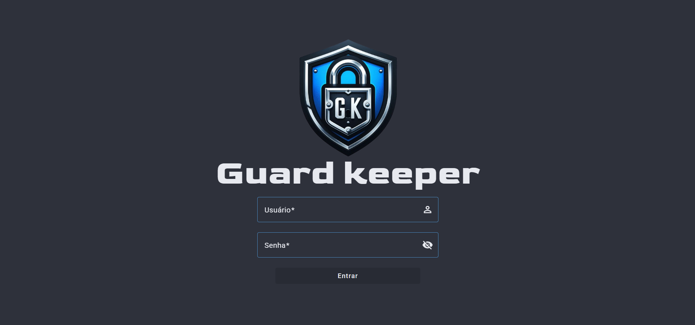
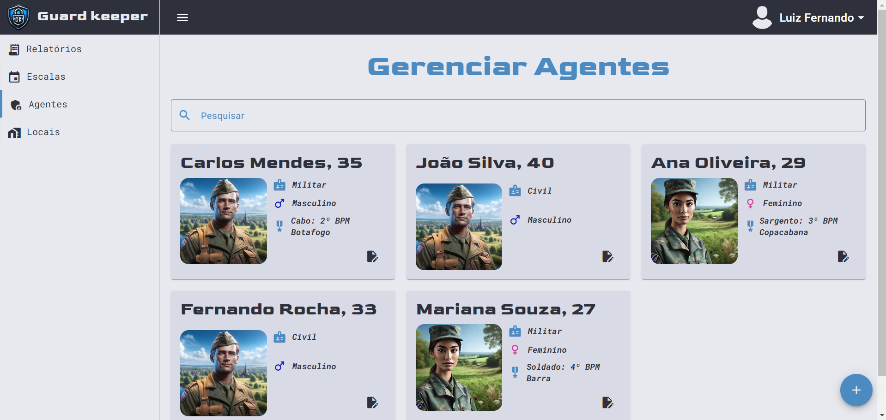

# 🛡️ Guard Keeper - Sistema de Gerenciamento de Escalas

**Status:** 🚧 Em desenvolvimento

## 📖 Sobre o Projeto

O **Guard Keeper** é uma aplicação desenvolvida em Angular 16 utilizando Material Design, com o objetivo de facilitar a gestão de escalas de segurança e guardas em diferentes localidades. O sistema é voltado para empresas de segurança que necessitam gerenciar a alocação diária de funcionários de maneira prática e eficiente.
O sistema está sendo desenvolvido para ser responsivo.

---

## 🌟 Funcionalidades Principais

- **Escalação diária de guardas** para localidades específicas.
- **CRUD completo de agentes e localidades**:
  - Cadastro, edição e exclusão de agentes e localidades.
  - Gerenciamento de localidades.
- **Relatórios detalhados**:
  - Relatórios financeiros.
  - Informações detalhadas de escalas e alocações.

---

## 📸 Demonstração

Aqui estão algumas capturas de tela do Guard Keeper em ação:

### Tela de Login

### Tela de Agentes

### Tela de Escala
.png)
.png)

.png)

*Nota: Imagens são apenas demonstrativas e podem sofrer alterações até a versão final.*

---

## 🛠️ Tecnologias Utilizadas

- **Angular 16**
- **Material Design**
- **TypeScript**

---

## ⚠️ Aviso

Este projeto está em fase de desenvolvimento e, atualmente, não está preparado para contribuição externa ou instalação. O foco do repositório é demonstrar o progresso e as funcionalidades do sistema.

---

## 🖊️ Autor

- **Gabriel Ciriaco Fornitano**
- Perfil: [https://github.com/GabrielCiriaco/](https://github.com/GabrielCiriaco/)

---

